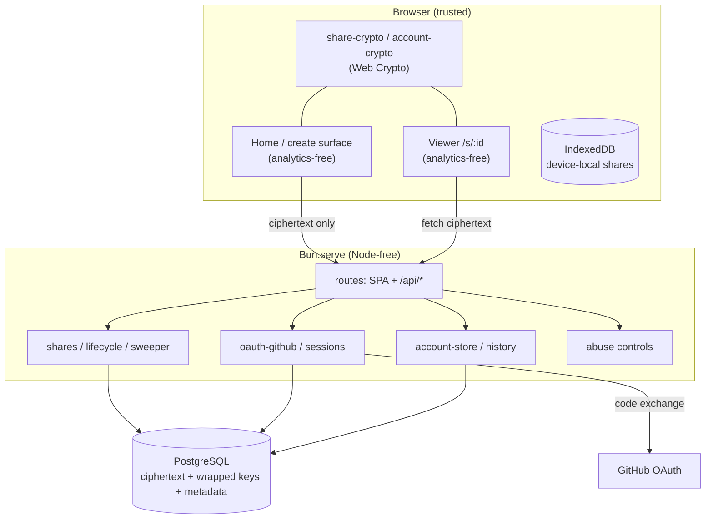
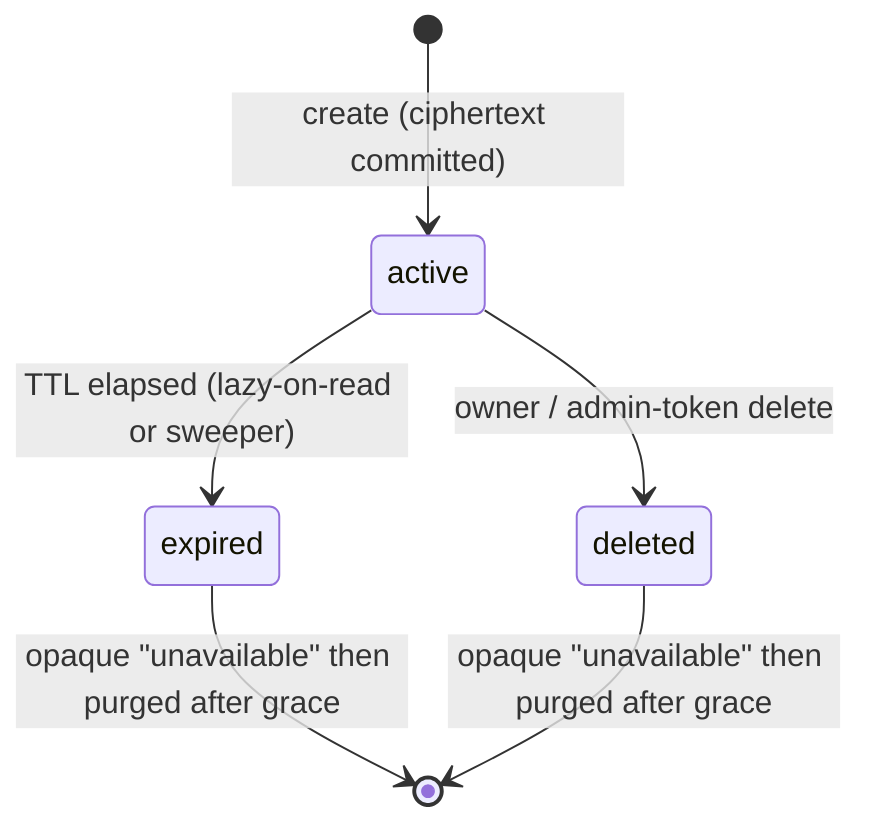
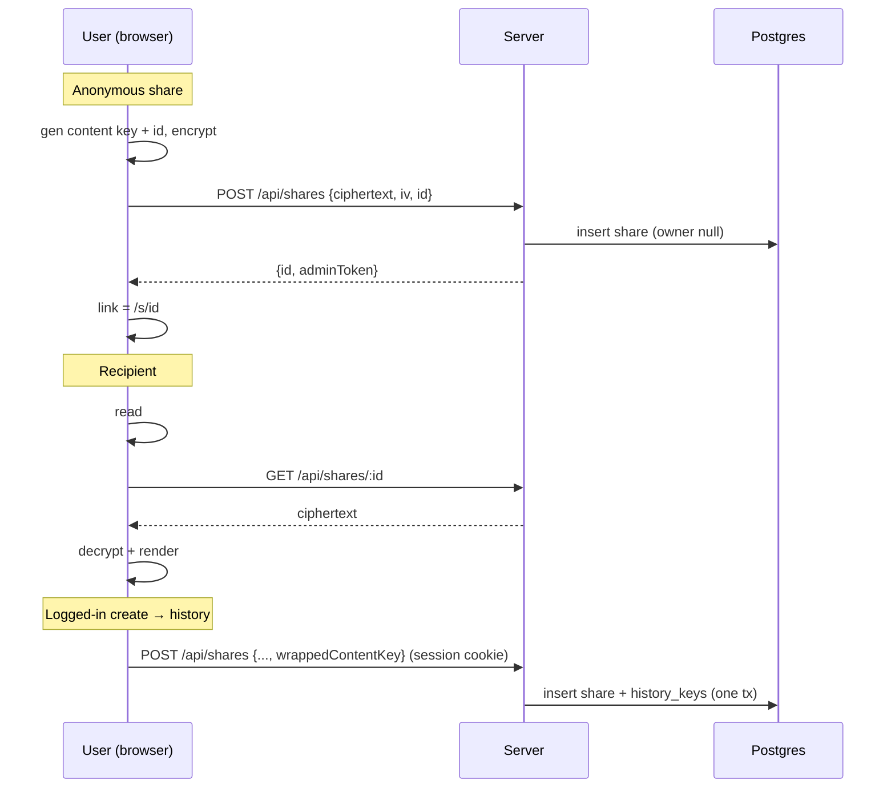

# Architecture

`jsonl-tools` is two things in one app:

1. A **browser-only** inspector for Claude Code JSONL session files (paste,
   view, analyze durations, bulk-analyze) — no data leaves the browser.
2. A **zero-knowledge sharing layer**: encrypt a session in the browser, upload
   only ciphertext, and share a link whose decryption key never reaches the
   server. Optional accounts add durable, cross-device history.

This document describes the system as built (Phase A: anonymous sharing; Phase
B: accounts, history, recovery).

---

## The zero-knowledge invariant

The single property everything else serves:

> The server stores ciphertext and wrapped keys it **cannot read**. The
> decryption keys live only in the client and in share-link URL fragments.

Concretely:

- Every session is encrypted in the browser with a random **AES-256-GCM content
  key**.
- The content key rides in the share link's **URL `#fragment`**, which browsers
  never send to the server.
- For logged-in history, the content key is also **wrapped under the user's
  account key**; the server stores the wrapped blob, useless without the
  passphrase.

A database dump plus full server access yields no session content and no usable
key (for strong passphrases — see [Security model](#security-model)).

---

## High-level components



The **key never crosses the Browser→Server edge** — it travels out-of-band in the
share link's fragment.

---

## Technology

| Concern | Choice |
|---|---|
| Runtime / bundler / tests | **Bun** (`Bun.serve`, `bun build`, `bun test`) |
| Frontend | **React 19**, HTML-import bundling (no Vite) |
| Server | `Bun.serve` `routes` object (no Express) |
| Database | **PostgreSQL** via `Bun.sql` (no `pg`/ORM) |
| Crypto | Browser **Web Crypto** (AES-GCM, PBKDF2, HKDF) — no WASM |
| Client storage | `idb-keyval` (IndexedDB) for the device-local recent-shares list |
| Auth | Hand-rolled GitHub OAuth (authorization-code + PKCE) |

Bun-native APIs are mandated by `CLAUDE.md`; there are no Node-only dependencies.

---

## Module layout & the client/server boundary

```text
src/
  index.ts              # Bun.serve: SPA routes + /api/* + maxRequestBodySize
  index.html / frontend.tsx / App.tsx   # home (analytics-free create surface)
  share.html / share-frontend.tsx / share-viewer.tsx   # viewer (analytics-free)
  bulk-analyzer.*       # bulk analyzer SPA
  entry-table.tsx       # shared JSONL renderer (home + viewer)

  share-crypto.ts       # content key, AES-GCM, fragment encode, share id
  account-crypto.ts     # PBKDF2 master key, account key, wrap/unwrap, recovery
  account-client.ts     # account + history orchestration (ties crypto to API)
  api-client.ts         # anonymous create orchestration
  local-store.ts        # device-local recent shares (idb-keyval)
  account.tsx           # sign-in / passphrase / recovery / My History panel
  wire-types.ts         # shared client/server request/response TYPES ONLY

  server/               # SERVER-ONLY — never bundled into the browser
    db.ts               # Bun.sql connection
    migrate.ts          # append-only, checksummed migration runner
    migrations/*.sql    # 001..006
    shares.ts           # create / fetch / delete + lifecycle
    sweeper.ts          # batched, single-flight expiry/purge
    abuse.ts            # rate limit, ban list, report, IP hashing
    oauth-github.ts     # OAuth flow + user upsert
    sessions.ts         # server-side revocable sessions + cookies
    account-store.ts    # account-key blob storage (session-scoped)
    history.ts          # My History list/delete + reconcile
```

**Boundary rule (enforced, not just documented):** nothing under `src/server/`
may be reachable from a browser entry, and no secret `process.env` value may
appear in a browser bundle. `src/boundary.test.ts` walks each browser entry's
import graph and fails the build if either is violated, and also asserts the
third-party analytics SDK is absent from the home and viewer bundles. Secrets are
plain `process.env` and **must never** carry the `BUN_PUBLIC_` prefix (which
`bunfig.toml`/the build inline into the browser).

---

## Cryptography

### Content encryption & sharing (Phase A)

- A fresh **AES-256-GCM** content key per session; a random 12-byte IV per
  encryption.
- The crypto **AAD binds the share id**, so a server can't serve one record's
  ciphertext under another id (substitution defense).
- The content key is exported **base64url into the link fragment**:
  `…/s/<id>#key=<key>`. The viewer reads it, strips it from the URL
  (`history.replaceState`) **before any network request**, fetches the
  ciphertext, and decrypts locally.

### Account key hierarchy (Phase B)

The key-chain diagram (passphrase → master → account key → machine key → content
key, including the CLI machine-key layer) is maintained in
[`public/security.md`](public/security.md#how-encryption-is-designed). The
implementation mechanics behind it:

- **Master key** is derived from the passphrase with PBKDF2-HMAC-SHA256 @ 600k
  iterations (Web Crypto native — no WASM). It is non-extractable.
- The **account key** is a random 256-bit AES-GCM key, wrapped twice: under the
  master key (for normal unlock) and under an HKDF(recovery-code) key (for the
  lost-passphrase path). Its **value is immutable** for the account's life —
  rotation only re-wraps it — which is what lets a wrapped content key written on
  one device unwrap on another.
- A **verifier** (known plaintext under the master key, with KDF params bound in
  AAD) distinguishes a wrong passphrase from a corrupted blob.
- On returning login the client **floors server-returned KDF params** (≥600k,
  SHA-256, 16-byte salt) and refuses to derive below it (anti-downgrade).
- An **auth tag** (a domain-separated PBKDF2 derivation) and a **recovery auth
  tag** (HKDF of the recovery code) are stored server-side as one-way proof
  tokens. Rotation requires presenting one of them, so a stolen session alone
  cannot overwrite custody (anti denial-of-custody).

### What the server can and cannot see

The model-level table — including the CLI machine-key additions — is in
[`public/security.md`](public/security.md#what-crosses-the-browserserver-edge).
In short: the server holds ciphertext, IV, wrapped keys, one-way verifier /
auth-tag / token-secret hashes, and metadata (ids, sizes, timestamps, expiry,
salted IP hashes, GitHub identity); it never sees plaintext, content / account /
machine keys, passphrases, recovery codes, or token secrets.

**On storing the `login`.** Until the sign-in-menu design (2026-06-04) the server
stored only the opaque numeric `github_id` (the `users.github_id` column is
explicitly "not the login"). To show `@username` in the menu we now also persist
the GitHub `login` (the nullable `users.login` column in `001-schema.sql`). This is a conscious, documented
expansion of stored identity — the first human-readable identifier the server
keeps. It is exposed only to the authenticated user via `GET /api/auth/me`; it adds
**no third-party requests** (the username is rendered as text, with no avatar
image fetch). It is unrelated to key custody: no key material is derived from
OAuth, so the zero-knowledge invariant is unchanged.

---

## Data model

```mermaid
erDiagram
  users ||--o{ sessions : has
  users ||--|| account_keys : has
  users ||--o{ history_keys : owns
  shares ||--o{ history_keys : referenced_by
  shares ||--o{ report_abuse : reported_in

  shares {
    text id PK
    bigint owner_user_id "null = anonymous"
    bytea ciphertext "null when tombstoned"
    text iv
    jsonb aad
    text encrypted_title
    int size_bytes "server-derived"
    text state "active|expired|deleted"
    timestamptz expires_at
    text admin_token_hash
    text uploader_ip_hash
  }
  users { bigserial id PK; bigint github_id "unique"; text login "GitHub @username, nullable" }
  sessions { text id PK; bigint user_id FK; timestamptz expires_at }
  account_keys { bigint user_id PK; jsonb kdf; jsonb wrapped_under_master; jsonb wrapped_under_recovery; jsonb verifier; text auth_tag; text recovery_auth_tag; int version }
  history_keys { bigint user_id FK; text share_id FK; jsonb wrapped_content_key }
  report_abuse { bigserial id PK; text share_id FK; text reporter_ip_hash }
  banned_ips { text ip_hash PK }
```

`history_keys` FKs to both `users` and `shares` use `ON DELETE CASCADE`, so
deleting/purging a share (or a user) removes the history rows — no orphans.
Migrations are append-only and checksummed (`schema_migrations` ledger);
`001`→`006` create the schema incrementally and an applied file is never edited.

---

## Share lifecycle



- **Expiry** is enforced both lazily on read and by a batched, single-flight
  **sweeper** (`pg_try_advisory_lock` + `FOR UPDATE SKIP LOCKED`).
- `deleted`/`expired` are **tombstones** (ciphertext nulled, uploader IP nulled);
  physical purge happens after a grace window. Unknown / expired / deleted all
  return one **opaque "unavailable"** so an id's existence never leaks; transient
  DB errors return a distinct retryable status so a recipient never reads "gone".
- Anonymous shares get a **mandatory max TTL** — the only automatic cleanup.

---

## Key flows



Other flows: GitHub OAuth + PKCE login → session cookie; passphrase setup →
store wrapped blobs; unlock → fetch blobs + decrypt locally; reconcile →
per-item idempotent upsert of device-local shares into history; rotation /
recovery → re-wrap the account key and re-issue the recovery code.

---

## API surface

| Route | Purpose |
|---|---|
| `GET /*`, `/bulk-analyzer`, `/s/:id` | SPA bundles (home, bulk analyzer, viewer) |
| `POST /api/shares` | create (anonymous, or logged-in → history) |
| `GET /api/shares/:id` | fetch ciphertext (lazy-expiry, opaque terminal states) |
| `DELETE /api/shares/:id` | delete via admin token or ownership |
| `POST /api/report` | abuse report (opaque, rate-limited, no auto-action) |
| `GET /api/auth/login` · `GET /api/auth/callback` · `POST /api/auth/logout` | OAuth + sessions |
| `GET /api/auth/me` | identity (`{ login }`, 200 valid session / 401); works pre-account-setup |
| `GET/POST /api/account` · `GET /api/account/recovery` · `POST /api/account/rotate` | account-key blobs |
| `GET /api/history` · `DELETE /api/history/:id` · `POST /api/reconcile` | durable history |

All state-changing routes reject cross-site requests (Origin / `Sec-Fetch-Site`);
all account/history routes derive the user from the **session only** (never a
client-supplied id).

---

## Security model

The security model — the zero-knowledge guarantee, what is and isn't protected,
claims, honest non-goals, per-artifact capabilities (share link vs account
passphrase vs CLI credential), and revocation blast radius — is maintained as the
**single source of truth** in **[`public/security.md`](public/security.md)**. It
supersedes the per-claim lists that previously lived here, so the two don't drift.

**Transport hardening — where it lives.** The app sets `maxRequestBodySize`, a
`referrer` meta on the viewer page, and the structural no-analytics/no-server-leak
guarantees. **CSP, HSTS, `Cache-Control: no-store` on ciphertext responses, and a
global `Referrer-Policy` header are expected to be configured at the reverse
proxy** (see [`DEPLOYMENT.md`](DEPLOYMENT.md)) — they are not yet emitted by the
app server.

---

## Testing

- **Crypto & client orchestration**: pure unit tests with real Web Crypto; an
  in-memory fake server proves no plaintext or keys are ever uploaded.
- **Server**: integration tests against real Postgres (create/fetch/delete,
  lifecycle, sweeper, abuse, OAuth with stubbed GitHub HTTP, sessions, account
  store, history, reconcile). They skip cleanly when `DATABASE_URL` is unset.
- **Boundary**: `src/boundary.test.ts` enforces the client/server + analytics
  boundaries at build-graph level.

Run `bun test` (set `DATABASE_URL` to include the DB-backed tests).
