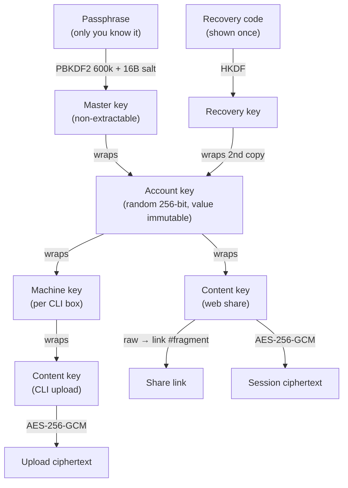
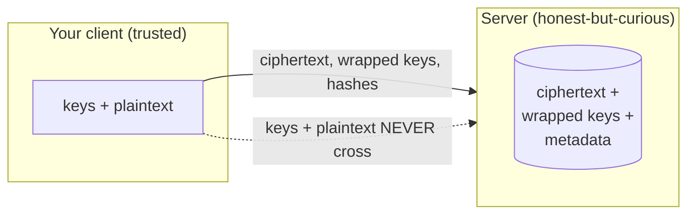

# Security model

How jsonl-tools encrypts your data, what that protects, and — just as important —
what it does **not** protect.

This document is the **single source of truth for the security model** — the
guarantees, risks, non-goals, and per-artifact capabilities. The internal
[`docs/ARCHITECTURE.md`](../ARCHITECTURE.md) covers how the system is *built*
(components, data model, flows) and defers to this document for the model.

---

## The core guarantee

> **The server stores ciphertext and wrapped keys it cannot read.** Decryption
> keys live only in your client and in share-link URL fragments — never in a
> request body, never at rest on the server.

A full database dump plus complete server access yields **no session content and
no usable key** (for strong passphrases — see [Risks](#risks--what-is-not-protected)).
This is *zero-knowledge*: the service operates on your data without being able to
read it.

---

## How encryption is designed

Every piece of plaintext is encrypted under a key the server never holds. Keys
form a chain — each layer wraps (encrypts) the next — so the only thing that
unlocks everything is something only you have: your passphrase (or, for a server
box, its credential).

**The three encryption surfaces:**

- **Anonymous share** — a fresh **AES-256-GCM** content key per session; the key
  rides only in the share link's URL `#fragment` (browsers never send fragments to
  the server). Encrypt in the browser, upload ciphertext, share the link.
- **Account history** — for logged-in users, the same content key is *also* wrapped
  under your **account key** and stored, so your shares follow you across devices.
  The account key is a random 256-bit key, itself wrapped under your passphrase
  (and a second copy under a recovery code). Its value never changes — rotation
  only re-wraps it — which is why a key written on one device unwraps on another.
- **CLI upload** — a server box gets a per-box **machine key** (wrapped under your
  account key, stored server-side; the raw bytes live only in the box credential).
  CLI uploads wrap their content key under the machine key. The web app unwraps the
  machine key under your account key, so CLI uploads and web shares appear in one
  history. See [`cli.md`](./cli.md) and [`api.md`](./api.md).

Throughout, the GCM **additional authenticated data binds the share id**, so the
server cannot serve one record's ciphertext under another id (substitution
defense).

### What crosses the browser↔server edge

| The server holds | The server never sees |
|---|---|
| Ciphertext, IV, format version | Plaintext sessions or titles |
| Wrapped keys (account-side stored wrapped; fragment-side never stored) | Content keys, account key, master key, machine keys |
| One-way verifier + auth tags + token-secret hashes | Passphrases, recovery codes, token auth secrets |
| Metadata: ids, sizes, timestamps, expiry, salted IP hashes, GitHub identity | — |

---

## What's granted, and what isn't

Three artifacts carry capability. Each grants exactly one thing and **nothing
beyond it** — losing one never escalates to the others.

| Artifact | Holder | Grants | Does **not** grant |
|---|---|---|---|
| **Share link** (`/s/<id>#key=…`) | Anyone you send it to | Read that one share | Any other share; your account; write access |
| **Account passphrase** | You | Decrypt all *your* shares + history, on any device | Anyone else's data; the server can't derive it |
| **CLI credential** (`jt1_…`) | A server box | Upload as you; decrypt **that box's** uploads | Your web shares; your account key; other boxes' uploads |

The design principle: **the link is the capability** for sharing, and each
credential's blast radius is bounded to exactly its own scope.

---

## Claims — what we guarantee

- **Zero-knowledge at rest.** A database dump + full server access reveals no
  content and no usable key (strong passphrases).
- **Keys never transit the server.** The content key travels out-of-band in the
  link fragment; the viewer strips it from the URL *before any network request*.
- **Per-user isolation by authorization, not just crypto.** Account and history
  queries are scoped to the session user server-side — never to a client-supplied
  id.
- **Substitution / IDOR resistance.** GCM AAD binds the share id into every
  ciphertext.
- **Anti-downgrade.** The client floors server-returned KDF params (≥600k
  iterations, SHA-256, 16-byte salt) and refuses to derive below it.
- **Anti denial-of-custody.** Rotating account custody requires proving the
  current passphrase or recovery code (a stored one-way auth tag), so a stolen
  session alone can't overwrite your keys.
- **Revocable sessions & tokens.** Sessions live in a `__Host-` cookie backed by a
  server row (logout deletes it); CLI tokens are revocable per box.
- **Bounded credentials.** A leaked CLI credential exposes only that box's
  uploads — never your web shares or account key.
- **Abuse controls** on anonymous upload: per-IP + global rate/volume caps, a size
  cap, mandatory TTL, report + operator takedown, salted IP hashing.
- **Transport secrets stay header-only.** Token auth secrets ride the
  `Authorization` header (never a URL), over HTTPS, and are never logged.

---

## Risks — what is **not** protected

Stated plainly, because an honest threat model is part of the security.

- **A compromised server can serve tampered JavaScript** that exfiltrates keys
  *before* encryption. This is the fundamental limit of browser-delivered E2EE.
  CSP / SRI / HSTS / `Referrer-Policy` are partial mitigations (configured at the
  reverse proxy); a pinned native client is the only full escape hatch.
- **The link is the capability.** Anyone with the full `/s/<id>#key=…` link can
  read that share. Treat links like secrets.
- **Weak passphrases are offline-crackable.** The verifier + public salt +
  iteration count make a DB dump useless only against *strong* passphrases. Choose
  a strong one (the app generates a strong default).
- **Metadata is visible to the server** — a share's existence, size, timing, and
  a salted uploader-IP hash within retention. Content is hidden; the fact that
  *something* exists is not.
- **Recovery is code-only.** Lose both your passphrase and recovery code and your
  history is unrecoverable — by design.
- **A CLI box holds a key.** The credential file carries a decryption-capable
  machine key. A compromised box can decrypt that box's uploads, and any plaintext
  it already downloaded is outside the product's reach. Protect the `0600`
  credential file; don't pass the credential via `--token`/env on shared hosts
  (those leak into `ps`, shell history, and CI logs).
- **Revocation is not clawback.** Revoking a CLI token stops *future* uploads and
  reads from that box; it cannot un-decrypt data already pushed or already
  downloaded. To deny a leaked machine key a past upload, revoke the token **and
  delete that upload**.
- **At-rest convenience features relax memory-only-key.** *Remembered unlock*
  keeps your account key on a device (a non-extractable device key in IndexedDB,
  bound to your GitHub login) until sign-out; *remembered shares* keep a received
  share's content key on the viewer's device so the bare `/s/<id>` re-opens. Both
  are cleared by "Forget this device" / per-share "Forget"; neither writes your
  passphrase. A shared browser profile on a stolen device is in scope.

---

## Revocation & blast radius

| Action | Stops | Does not undo |
|---|---|---|
| Delete a share / upload | Future reads (ciphertext tombstoned) | Copies already downloaded or links already opened |
| Revoke a CLI token | That box's future uploads/lists/downloads | Decryption of data already pushed or pulled by that box |
| Sign out / "Forget this device" | This device's remembered account key | Anything already exported off the device |
| Rotate passphrase | Use of the old passphrase | The account key's value is immutable — rotation re-wraps, it does not re-key existing data |

---

## Cryptographic primitives

| Purpose | Primitive |
|---|---|
| Content / upload encryption | **AES-256-GCM**, random 12-byte IV per encryption, AAD binds `{version, alg, share id}` |
| Passphrase → master key | **PBKDF2-HMAC-SHA256**, ≥600,000 iterations, 16-byte salt, non-extractable |
| Recovery code → recovery key | **HKDF-SHA256** |
| Key wrapping (account / machine / content) | **AES-GCM wrapKey/unwrapKey** |
| Token / admin-token / IP storage | **SHA-256** (high-entropy secrets; fast hash is appropriate), constant-time compare |
| Identity / sessions | GitHub OAuth (authorization-code + PKCE); server-side revocable session in a `__Host-` cookie |

All crypto is browser-native **Web Crypto** — no WASM, no custom implementations.

---

## Reporting a vulnerability

Found a weakness in this model or its implementation? Please report it privately
to the maintainer rather than opening a public issue.

---

## See also

- [`cli.md`](./cli.md) — the CLI client and its credential/security model.
- [`api.md`](./api.md) — the HTTP API and server-side entity model.
- [`docs/ARCHITECTURE.md`](../ARCHITECTURE.md) — the authoritative internal design.
